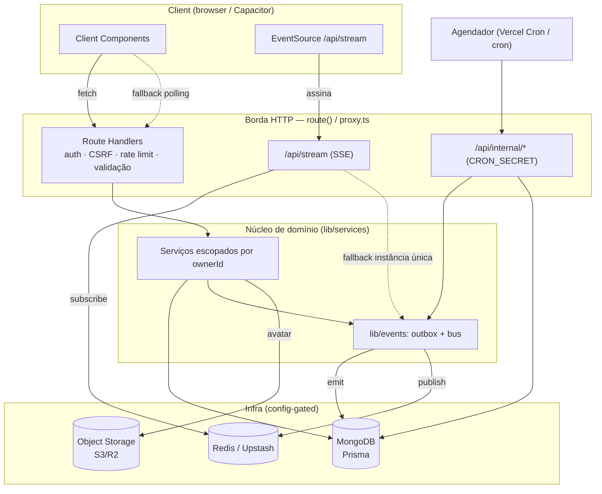

# Arquitetura do Biblion

Biblion é um **monólito modular** em Next.js 16 (App Router) + React 19 +
Prisma/MongoDB, com camadas de responsabilidade claras e infraestrutura opcional
ativada por configuração (degradação graciosa quando ausente).

- Fronteiras de módulo e direção das dependências: [`modules.md`](./modules.md)
- Escala, pooling e operação: [`scaling.md`](./scaling.md)
- Decisões arquiteturais (por que fizemos assim): [`adr/`](./adr/)

## Visão geral

## Fluxos principais

- **Requisição normal**: Client → `route()` (auth, CSRF, rate limit, validação) →
  serviço (escopado por `ownerId`, 404 anti-enumeração) → Prisma/Mongo → DTO mínimo.
- **Notificação / tempo real**: a ação de domínio emite um evento no **outbox**
  (insert rápido, durável). A entrega roda fora do request (via `after()`; o cron
  reentrega falhas), cria a notificação e publica no **bus**. O stream **SSE** do
  destinatário recebe o evento; o client atualiza. Sem SSE/Redis, o client cai no
  **polling**.
- **Jobs internos**: um agendador chama `/api/internal/*` (manutenção, outbox,
  seed, migração de avatares) autenticado por `CRON_SECRET`.
- **Conteúdo/mídia**: Bíblia/hinos servidos do Mongo (com fallback ao filesystem);
  avatares no object storage (com fallback a base64 no banco).

## Infra opcional (degradação graciosa)

| Recurso            | Sem a infra                              | Com a infra                          |
| ------------------ | ---------------------------------------- | ------------------------------------ |
| Redis (Upstash)    | rate limit em memória; SSE em processo   | rate limit consistente; pub/sub SSE  |
| Object storage     | avatar como data URL base64 no banco     | imagem no bucket, URL pública/CDN    |
| `CONTENT_SOURCE`   | Bíblia/hinos do filesystem               | Bíblia/hinos do Mongo (+ fallback fs)|
| `CRON_SECRET`      | rotas internas recusam (503, fail-closed)| jobs de manutenção/outbox/seed ativos|
